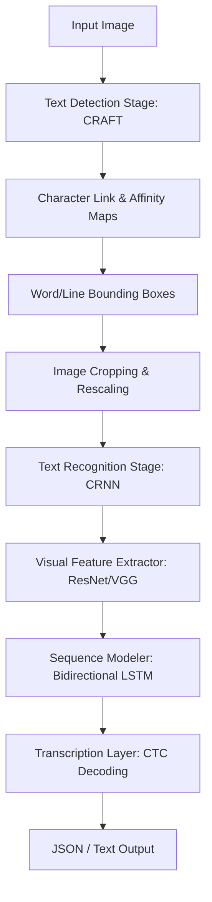
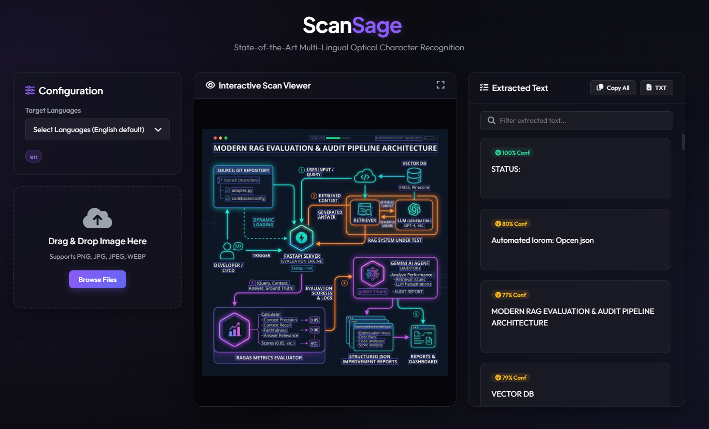

# ScanSage 🧠🔍

**ScanSage** is an advanced, multilingual Optical Character Recognition (OCR) solution built on PyTorch. It enables high-accuracy text detection and recognition on diverse documents, technical diagrams, flowcharts, and natural images. 

This repository features a **complete, high-performance API backend** (powered by FastAPI) and an **interactive Web UI Dashboard** utilizing a premium glassmorphic dark theme, enabling real-time image scanning, bidirectional hover highlighting, and text exports.

---

## 🚀 Key Use Cases

ScanSage is designed to solve a wide range of real-world text extraction problems:
* **Technical Diagrams & Flowcharts**: Extracting textual labels and steps from system architecture diagrams (as shown in the demo image below).
* **Multilingual Document Digitization**: Scanning invoices, legal contracts, and academic papers containing mixed character sets (e.g., English, Chinese, Hindi, Japanese, Korean).
* **Industrial & Administrative Auditing**: Digitizing structured system charts, pipelines, and logs for automated audit pipelines.
* **Accessibility & Translation**: Providing clear character transcribing inputs for translation engines and screen readers.

---

## 🛠️ System Architecture

ScanSage follows a two-stage OCR pipeline (Text Detection followed by Text Recognition):



### Stage 1: Text Detection (CRAFT)
The engine utilizes the **Character Region Awareness for Text Detection (CRAFT)** model. Rather than predicting raw bounding boxes directly, CRAFT predicts two spatial heatmaps:
1. **Region Score**: Defines the probability that a pixel is the center of a character.
2. **Affinity Score**: Defines the probability that two characters are part of the same word or line (indicating space/connection).

These scores are grouped to generate tight, rotated bounding boxes for words and paragraphs, which are then cropped and passed to the next stage.

### Stage 2: Text Recognition (CRNN + CTC)
The recognition pipeline utilizes a **Convolutional Recurrent Neural Network (CRNN)**:
* **Feature Extraction (CNN)**: ResNet or VGG backbone extracts visual features from the cropped word images.
* **Sequence Modeling (RNN)**: A Bidirectional LSTM (BiLSTM) processes the visual feature maps horizontally, capturing contextual dependencies between letters.
* **Transcription (CTC)**: A Connectionist Temporal Classification (CTC) layer decodes the sequence vectors into string characters without requiring frame-by-frame letter alignment.

---

## 🧠 Deep Learning Concepts Used

* **Character-Level Representation**: Utilizing heatmaps for region and affinity scores allows CRAFT to detect curved, skewed, and irregular text orientations much better than traditional horizontal box detectors.
* **Convolutional Feature Mapping**: Converts 2D spatial pixel maps into sequence representations.
* **Bidirectional LSTMs**: Captures context from both left-to-right and right-to-left directions, which is critical for deciphering ambiguous characters (e.g., distinguishing `'l'`, `'1'`, and `'I'`).
* **Connectionist Temporal Classification (CTC) Loss**: Solves the sequence alignment problem where the input image length does not map 1:1 to the text string length.
* **Bilinear Interpolation & Scaling**: During preprocessing, cropped images are upscaled to a uniform height (e.g., 64px) to preserve aspect ratios for the CNN backbone.

---

## 📊 Sample Visual Preview

When scanning a complex **Modern RAG Evaluation & Audit Pipeline Architecture** diagram, ScanSage successfully localizes and transcribes all components (e.g., *FastAPI Server*, *Gemini AI Agent*, *Vector DB*) with high confidence and overlays the results interactively:



---

## ⚡ Drawbacks & Limitations

While ScanSage is highly robust, there are certain trade-offs to keep in mind:

1. **CPU Latency**: Running neural network inference (especially CRAFT detection) on CPU can be slow (taking 3–8 seconds per page). A CUDA-capable GPU is strongly recommended for real-time applications (reducing latency to <1 second).
2. **Tiny/Dense Text Recognition**: Very small printed font sizes can lose resolution during text cropping, resulting in low-confidence predictions.
   * *Mitigation*: Adjust the `mag_ratio` (image magnification) parameter to `2.0` (as we did in the API) to upscale small text areas before recognition.
3. **Handwriting Limitations**: The pre-trained weights are optimized for printed multilingual document fonts. Hand-drawn text or calligraphy may result in poor recognition rates.
4. **Layout Analysis**: ScanSage reads left-to-right, top-to-bottom. For complex multi-column documents, additional page layout analysis (PLA) is needed to avoid merging separate columns into single lines.

---

## 💻 Quick Start & Running the Project

### 1. Installation
Ensure dependencies are installed:
```bash
pip install -e .
pip install fastapi uvicorn python-multipart
```

### 2. Run the Web Dashboard
Start the FastAPI server from the project root:
```bash
python web/app.py
```
Open **[http://127.0.0.1:8000](http://127.0.0.1:8000)** in your browser to upload images and scan interactively.
